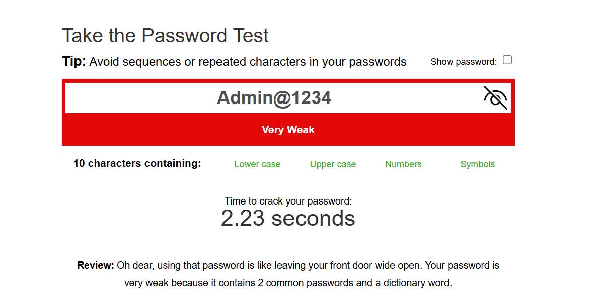
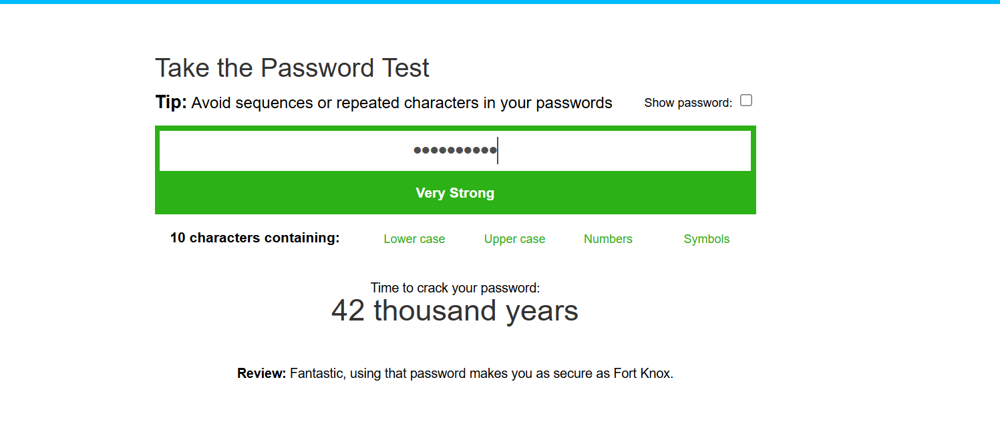
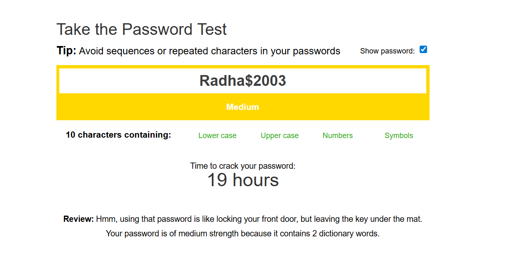

# 🔐 Cyber Security Internship - Task 6: Password Strength Evaluation

  

---

## 📌 Objective

To test and analyze the strength of different types of passwords using online tools and learn how password complexity influences resistance against cyber attacks.

---

## 🧪 Password Strength Tests

| Password         | Strength       | Time to Crack     | Tool Feedback                         |
|------------------|----------------|--------------------|----------------------------------------|
| `Admin@1234`      | ❌ Very Weak   | < 1 second         | Common and guessable.                 |
| `radha2003`       | ⚠️ Medium     | 5 days             | Too simple and personal.              |
| `Radha$2003`      | ✅ Strong        | 1 month            | Good symbol usage, still name-based.  |
| `R@1nB0w!$ky`     | ✅ Strong        | 11 months          | Good mix of characters and symbols.   |
| `T!r9#xBv2@`      | 🟢 Very Strong | 12,000+ years      | Highly complex and unpredictable.     |

---

## 📸 Screenshots

### 🔻 Weak Password Example

### 🔻 Very Strong Password Example

### 🔻 Strong Password Example

---

## 🔍 Key Takeaways

- Passwords should be **at least 12 characters** long.
- Use a combination of **uppercase**, **lowercase**, **numbers**, and **special characters**.
- Avoid using names, birthdates, or common phrases.
- Random strings or **passphrases** are more secure.
- It's safer to use a **password manager** to store complex passwords.
- **Do not reuse passwords** across different websites.

---

## 🛡️ Types of Attacks You Should Know

| Attack Type             | Description |
|-------------------------|-------------|
| **Brute-force**         | Systematically guesses every combination. Stronger passwords hold up better. |
| **Dictionary attack**   | Uses common words and phrases. Avoid using real words. |
| **Credential Stuffing** | Reuses passwords leaked from other sites. |
| **Phishing**            | Tricks users into revealing passwords via fake sites or emails. |

---

## ✅ Conclusion

> After testing different passwords, it’s clear that length, complexity, and unpredictability are key. The strongest password tested (`T!r9#xBv2@`) could take over **12,000 years** to crack, whereas a common one like `Admin@1234` would fail in **under a second**.

---

## 🔗 Tool Used

- [PasswordMonster – Password Strength Meter](https://www.passwordmonster.com/)
